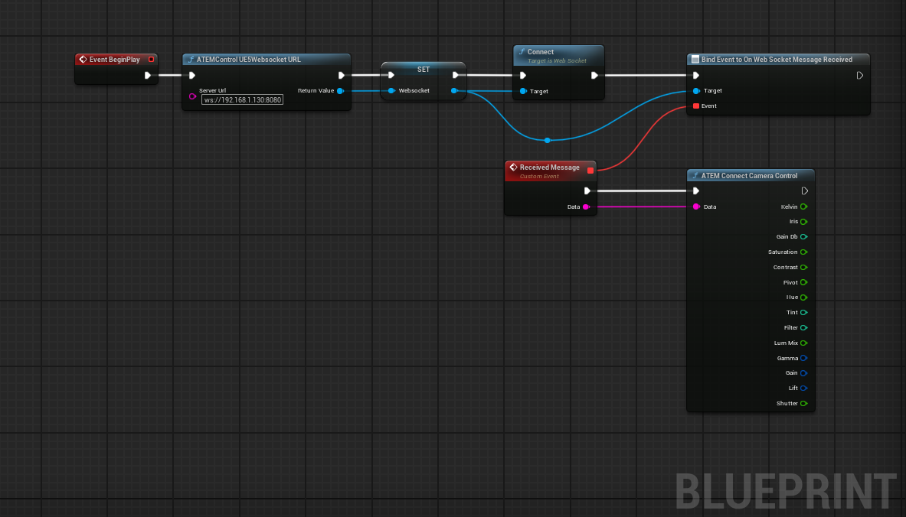

## ATEM Camera Remote Control UE5
This is a small program and Unreal Engine 5 plugin to control a virtual camera in UE5 trough the Camera Control Settings of an ATEM. While there is a small example blueprint included in the content folder of the UE5 plugin you probably still have to change what you want to change within a virtual camera using the given values in the node. 

Get the latest release in the releases section!

### Usage

- Start atem-connect-win.exe, fill in the CameraID you want to use and the IP of the ATEM. 
- Use the ws:// address that is given in the terminal in the Unreal Engine 5 plugin.
- Setup the plugin as in the picture to start receiving data (there is also a small example with some use cases included in content folder of the plugin)
- Within Camera Control settings of the ATEM make sure to pick the "Any Camera Type"

### Tested with: 

- ATEM SDI Extreme ISO running 9.5.1
- ATEM Constellation 8K running 9.6.3

  
### Disclaimer and Acknowledgement
This is using atem-connection-ccu package to get the data of the cameras and updates every time the ATEM state updates. Not all functions are accessible and any update to ATEM firmware could change the values or break the data as stated in the atem-connection documentation. 
